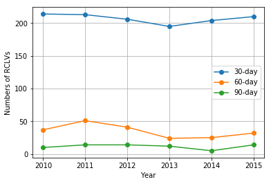
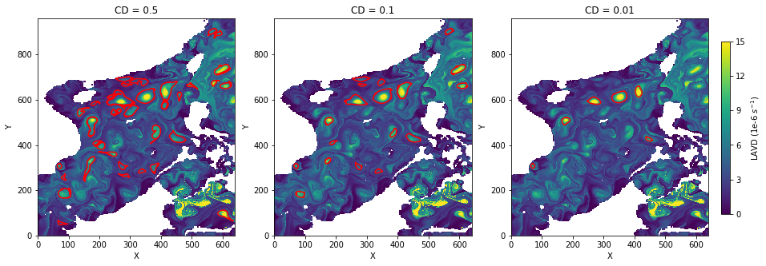

## South China Sea Lagrangian Eddies Dataset (2010 - 2015)

(https://doi.org/10.6084/m9.figshare.8044250.v3)

Tongya Liu and Ryan Abernathey

### 1 Introduction

Rotationally coherent Lagrangian vortices (RCLVs) are detected from satellite-derived surface geostrophic velocities in the global ocean using the Lagrangian coherent structure detection method (Haller, 2016) based on the Lagrangian-averaged vorticity deviation (LAVD). The South China Sea (SCS) Lagrangian eddies dataset, with the time series from Jan. 2010 to Dec. 2015, is extracted from the global RCLVs atlas.

To identify RCLVs, millions of 2-D Lagrangian particles (resolution of 1/32 degree) were initialized over the domain on the first day of each month and advected forward for 180 days (6 months) driven by daily surface geostrophic velocities. The details of particles advection can be found in Abernathey and Haller (2018). Our global atlas contains RCLVs with the lifespan from 30 days to 180 days detected in every integration time interval. This SCS dataset contains 30-day, 60-day, and 90-day RCLVs, for the Lagrangian eddies could live for 90 days is very few in the SCS (Fig. 01).

Fig. 01 The total numbers of RCLVs in SCS from 2010 to 2015.

The RCLVs boundaries are defined by the outermost closed and convex curves around LAVD maxima. The convexity deficiency (CD) is introduced to select the boundaries. Fig. 02 shows that the loose CD (0.5) would detect some filament incoherent structures around eddies, and the rigorous CD (0.01) would filter out some real coherent eddies, so we used a moderate CD (0.1) to select RCLVs boundaries, which is proved reasonable in the work of Tarshish et al. (2018).

Fig. 02 The 30-day RCLVs boundaries selected by different CDs in Jan. 2013.

### 2 File and data structure

The dataset is available on Figshare. (https://figshare.com/articles/South_China_Sea_Lagrangian_Eddies_Dataset/8044250/3)

In the dataset main directory, there are two directories named 'RCLV_info' and 'Trajectory', which are used to put RCLVs general information (RCLV id, radius, lifespan, etc.) files in CSV format and each 10 days particles positions files in NETCDF format, respectively. The general information files are grouped by year and eddy duration (e.g. 'RCLV_30day_2010.csv'). Each particles postions file is named by its unique RCLV ID (e.g. '20100101_030day_000001.nc'). After reading the RCLV ID from *.csv files, the corresponding particles trajectories files in 'Trajectory' could be matched.

##### Column names and units in CSV files
- id: RCLVs ID
- date_start: Initial day
- date_end: Final day
- duration: Lifespan (day)
- area: Area (km^2)
- radius: Radius (km)
- cyc: Anticyclonic 1 & Cyclonic -1
- center_traj: The trajectories of the center points
- dx (dy): Displacement along x (y) direction (km)
- speed_x (speed_y): Phase speed along x (y) direction (m/s)

### 3 Data visualization

See data_visualization.ipynb.

### References
1. Abernathey, Ryan, and George Haller. "Transport by lagrangian vortices in the eastern pacific." Journal of Physical Oceanography 48.3 (2018): 667-685.
2. Tarshish, Nathaniel, et al. "Identifying Lagrangian coherent vortices in a mesoscale ocean model." Ocean Modelling 130 (2018): 15-28.
3. Haller, George, et al. "Defining coherent vortices objectively from the vorticity." Journal of Fluid Mechanics 795 (2016): 136-173.

